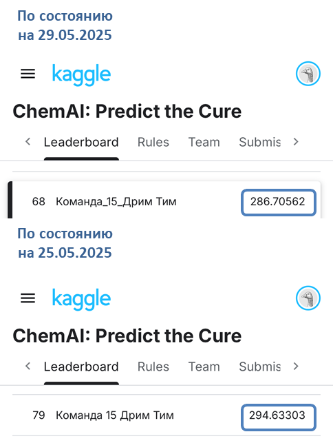

# dream_team_15_project
Задача хакатона. ChemAI: Predict the Cure

# Инструкция по запуску:
1) Три стартовых ноутбука для каждого из показателей:
- установка зависимостей: pip install -r requirements_start.txt
- запуск Jupyter Notebook: jupyter notebook
- выберите нужный файл: IC.ipynb, CC.ipynb или SI.ipynb

2) **Основной ноутбук:**
- установка зависимостей: pip install -r requirements_finish.txt
- запуск Jupyter Notebook: jupyter notebook
- выберите нужный файл: Команда_15_Дрим Тим.ipynb

Все ноутбуки доступны к быстрому просмотру в GitHub: нажмите на любой .ipynb файл и GitHub автоматически отобразит содержимое блокнота.

# Описание исследуемой сферы
Разработка новых лекарственных препаратов - сложный и длительный процесс, включающий синтез соединений и их биологическое тестирование. 
Современные методы машинного обучения позволяют ускорить этот процесс, предсказывая эффективность химических соединений до проведения лабораторных экспериментов. 

# Цель проекта
На основе предоставленных химиками заказчика данных о свойствах молекул и их биологической активности против вируса гриппа необходимо **построить модели, способные предсказывать эффективность новых соединений**: для каждого химического соединения необходимо создать pipline решения и предсказать три показателя:
- IC50 (mM) — концентрация, при которой вещество подавляет 50% активности вируса;
- CC50 (mM) — концентрация, при которой вещество токсично для 50% клеток;
- SI (Selectivity Index) — индекс селективностит.

# Условия выполнения
1) Участие в соревновании на платформе Kaggle.

2) Загрузка на образовательную платформу ссылки на Git-репозиторий, который должен содержать:
- код решения;
- описание подхода (README);
- инструкции по воспроизведению результатов;
- презентацию проекта.

_Важно: SI связан с IC50 и CC50, вместе с тем, в рамках соревнования указанный показатель необходимо прогнозировать как самостоятельную переменную._

# Работа над проектом была выстроена следующим образом:
**Этап 1**: работа с каждым показателем отдельно (общий пайплан решения: заполнение пропусков средним значением - стандартизация признаков и применение метода PCA - удаление выбросов данных для показателя IC методом IQR - обучение трех моделей регрессии); 
**Этап 2**: обобщение результатов работы первого этапа - оптимизация решения (+ использование лучшей модели первого этапа и добавление двух альтернативных).

# Общие выводы по результатам реализации проекта
**В рамках исследования данных о свойствах молекул и их биологической активности в отношении вируса гриппа для целей обучения моделей, предсказывающих на основе указанных данных "IC50, mM"** (концентрация, при которой вещество подавляет 50% биологической активности вируса), **"CC50, mM"** (концентрация, при которой вещество токсично для 50% клеток) и **"SI"** (индекс селективности, характерезующий эффективность соединения), **получены следующие результаты:**

1) Осуществлены загрузка и чтение исходных данных:

Предметная область исследования представлена **двумя датасетами** ""train.csv" и "test.csv", содержащим данные **о свойствах молекул и их биологической активности в отношении вируса гриппа**.

**Тренировочные данные** представлены одним датасетом "train.csv", предназначенном для целей обучения моделей регрессии, предсказывающих три целевых показателя.

Датасет **содержит 751 запись в разрезе 214 показателей**:
- первый показатель "index" имеет технический характер и описывает номер по порядку записей;
- следующие **три показателя - целевые**: **"IC50, mM"** (концентрация, при которой вещество подавляет 50% биологической активности вируса), **"CC50, mM"** (концентрация, при которой вещество токсично для 50% клеток) и **"SI"** (индекс селективности, характерезующий эффективность соединения и который связан с двумя предыдущими показателями);
- оставшиеся 210 показателей - "входные" признаки - данные о свойствах молекул и их биологической активности.

**По результатам анализа загруженных данных:**
- выявлено **12 показателей с незначительным количеством пропусков** данных (по 2 пропуска или **0.3%** общего объема данных);
- **типы данных оцениваются как соответсвующие**: 107 показателей с типом "float64" и 107 - с типом "int64";
- **явные дубликаты не выявлены**;
- наименования столбцов необходимо привести к единообразию ("змеиный" регистр), но для целей воспроизводимости такое решение представляется избыточным.

**Тестовые данные** представлены одним датасетом "test.csv", предназначенном для целей проверки лучших моделей регрессии, обученных предсказывать три целевых показателя.

Датасет **содержит 250 записей в разрезе 211 показателей**:
- первый показатель "index" имеет технический характер и описывает номер по порядку записей;
- оставшиеся 210 показателей - "входные" признаки - данные о свойствах молекул и их биологической активности.

**По результатам анализа загруженных данных:**
- выявлено **12 показателей с незначительным количеством пропусков** данных (по 1 пропуску или **0.4%** общего объема данных);
- **типы данных оцениваются как соответсвующие**: 104 показателей с типом "float64" и 107 - с типом "int64";
- **явные дубликаты не выявлены**;
- наименования столбцов необходимо привести к единообразию ("змеиный" регистр), но для целей воспроизводимости такое решение представляется избыточным.

_Справочно: пропуски данных находятся в тех же показателях, что и пропуски данных в тренировочной выборке данных:_
- MaxPartialCharge;
- MinPartialCharge; 
- MaxAbsPartialCharge; 
- MinAbsPartialCharge;
- BCUT2D_MWHI;
- BCUT2D_MWLOW; 
- BCUT2D_CHGHI;
- BCUT2D_CHGLO;
- BCUT2D_LOGPHI; 
- BCUT2D_LOGPLOW; 
- BCUT2D_MRHI;
- BCUT2D_MRLOW.

_Справочно:_ 
Для целей корректного офрмления результатов предсказания лучшими моделями целевых показателей на тестовой выборке данных **предоставлен датасет** "sample_submission.csv" - **образец представления данных**. 
Таким образом, **результирующий датасет должен** быть предоставлен в формате ".csv" и **содержать следующие четыре показателя**:
- index: индификатор объекта из тестовой выборки (тип данных "int64");
- IC50: предсказание целевого показателя "IC50, mM" на тестовой выборке (тип данных "float64");
- CC50: предсказание целевого показателя "CC50, mM" на тестовой выборке (тип данных "float64");
- SI: предсказание целевого показателя "SI" на тестовой выборке (тип данных "float64").

**Учитывая вышеизложенное**, для целей дальнейшего исследователького анализа и обучения моделей предсказания целевых признаков **представляется целесообразным** для тренировочной и тестовой выборок данных:
- **удаление показателя "index"** как неинформативного для вышеуказанных целей;
- **заполнение пропусков данных медианой** уже на данном этапе работы над проектом с учетом их незначительного количества.

**Таким образом, исследуемые данные оцениваются как статистически значимые и соответсвующие требованиям и целям реализации проекта.**

2) Осуществлен исследовательский анализ данных:

**Исследовательски анализ данных выстроен следующим образом:**
- исследование "входящих" признаков осуществлено в разрезе показателей попарно для тренировочных и тестовых выборок данных для целей унификации процесса анализа, а также процесса обработки данных _(при такой необходимости)_;
- исследование целевых признаков тренировочной выборки данных.

По результатам анализа данных из тренировочной и тестовой выборки **выявлены группы "входящих" признаков** (36 групп), которые с учетом их наименований, **описывают однотипные группы свойств молекул и их биологической активности**:
- группа признаков "EStateIndex" (MaxAbsEStateIndex, MaxEStateIndex, MinAbsEStateIndex и MinEStateIndex);
- признак qed;
- признак SPS;
- группа признаков "MolWt" (MolWt, HeavyAtomMolWt и ExactMolWt);
- группа признаков "NumElectrons" (NumValenceElectrons и NumRadicalElectrons);
- группа признаков "PartialCharge" (MaxPartialCharge, MinPartialCharge, MaxAbsPartialCharge и MinAbsPartialCharge); 
- группа признаков "FpDensityMorgan" (FpDensityMorgan1, FpDensityMorgan2 и FpDensityMorgan3);
- группа признаков "BCUT2D" (BCUT2D_MWHI, BCUT2D_MWLOW, BCUT2D_CHGHI, BCUT2D_CHGLO, BCUT2D_LOGPHI, BCUT2D_LOGPLOW, BCUT2D_MRHI и BCUT2D_MRLOW);
- признак AvgIpc;
- признак BalabanJ;
- признак BertzCT;
- группа признаков "Chi" (Chi0, Chi0n, Chi0v, Chi1, Chi1n, Chi1v, Chi2n, Chi2v, Chi3n, Chi3v, Chi4n и Chi4v);
- признак HallKierAlpha;
- признак Ipc;
- группа признаков "Kappa" (Kappa1, Kappa2 и Kappa3);
- признак LabuteASA;
- группа признаков "PEOE_VSA" (PEOE_VSA1, PEOE_VSA10, PEOE_VSA11, PEOE_VSA12, PEOE_VSA13, PEOE_VSA14, PEOE_VSA2, PEOE_VSA3, PEOE_VSA4, PEOE_VSA5, PEOE_VSA6, PEOE_VSA7, PEOE_VSA8 и PEOE_VSA9);
- группа признаков "SMR_VSA" (SMR_VSA1, SMR_VSA10, SMR_VSA2, SMR_VSA3, SMR_VSA4, SMR_VSA5, SMR_VSA6, SMR_VSA7, SMR_VSA8 и SMR_VSA9);
- группа признаков "SlogP_VSA" (SlogP_VSA1, SlogP_VSA10, SlogP_VSA11, SlogP_VSA12, SlogP_VSA2, SlogP_VSA3, SlogP_VSA4, SlogP_VSA5, SlogP_VSA6, SlogP_VSA7, SlogP_VSA8 и SlogP_VSA9);
- показатель TPSA;
- группа показателей "EState_VSA" (EState_VSA1, EState_VSA10, EState_VSA11, EState_VSA2, EState_VSA3, EState_VSA4, EState_VSA5, EState_VSA6, EState_VSA7, EState_VSA8 и EState_VSA9);
- группа показателей "VSA_EState" (VSA_EState1, VSA_EState10, VSA_EState2, VSA_EState3, VSA_EState4, VSA_EState5, VSA_EState6, VSA_EState7, VSA_EState8, VSA_EState9);
- показатель FractionCSP3;
- показатель HeavyAtomCount;
- показатль NHOHCount;
- показатель NOCount;
- группа показателей "NumAliphatic" (NumAliphaticCarbocycles, NumAliphaticHeterocycles и NumAliphaticRings);
- группа показателей "NumAromatic" (NumAromaticCarbocycles, NumAromaticHeterocycles и NumAromaticRings);
- показатель NumHAcceptors;
- показатель NumHDonors;
- показатель NumHeteroatoms;
- показатель NumRotatableBonds;
- группа показателей "NumSaturated" (NumSaturatedCarbocycles, NumSaturatedHeterocycles и NumSaturatedRings);
- показатель RingCount;
- группа показателей "Mol" (MolLogP и MolMR);
- группа показателей "fr": бинарные признаки, отражающие наличие различных химических групп (fr_Al_COO, fr_Al_OH, fr_Al_OH_noTert, fr_ArN, fr_Ar_COO, fr_Ar_N, fr_Ar_NH, fr_Ar_OH, fr_COO, fr_COO2, fr_C_O, fr_C_O_noCOO, fr_C_S, fr_HOCCN, fr_Imine, fr_NH0, fr_NH1, fr_NH2, fr_N_O, fr_Ndealkylation1, fr_Ndealkylation2, fr_Nhpyrrole, fr_SH, fr_aldehyde, fr_alkyl_carbamate, fr_alkyl_halide, fr_allylic_oxid, fr_amide, fr_amidine, fr_aniline, fr_aryl_methyl, fr_azide, fr_azo, fr_barbitur, fr_benzene, fr_benzodiazepine, fr_bicyclic, fr_diazo, fr_dihydropyridine, fr_epoxide, fr_ester, fr_ether, fr_furan, fr_guanido, fr_halogen, fr_hdrzine, fr_hdrzone, fr_imidazole, fr_imide, fr_isocyan, fr_isothiocyan, fr_ketone, fr_ketone_Topliss, fr_lactam, fr_lactone, fr_methoxy, fr_morpholine, fr_nitrile, fr_nitro, fr_nitro_arom, fr_nitro_arom_nonortho, fr_nitroso, fr_oxazole, fr_oxime, fr_para_hydroxylation, fr_phenol, fr_phenol_noOrthoHbond, fr_phos_acid, fr_phos_ester, fr_piperdine, fr_piperzine, fr_priamide, fr_prisulfonamd, fr_pyridine, fr_quatN, fr_sulfide, fr_sulfonamd, fr_sulfone, fr_term_acetylene, fr_tetrazole, fr_thiazole, fr_thiocyan, fr_thiophene, fr_unbrch_alkane и fr_urea).

Одновременно, **распределение значений одинаковых признаков тренировочной и тестовой выборок данных имеет идентичный характер**, явные патерны, свидетельствующие в пользу наличия различий во "входящих" признаках не выявлены.

Вместе стем, **по результатам дополнительного анализа "входящих" признаков выявлено**:
- **18 показателей**, которые как в тренировочной, так и в тестовой выборке, имеют **константные значения** для всех наблюдений, в связи с чем представляется целесообразным удаление таких признаков, которые не несут дополнитльной информации и не способны улучшить предсказательную способность данных;
- **6 показателей - дубликатов** в тренировочной выборке и **11 показателей - дубликатов** в тестовой, то есть показателей, чьи значения идентичны между 6-тью и 11-тью показателями соответственно, в связи с чем редставляется целесообразным удаление 6-ти общих признаков, которые также не несут дополнитльной информации.

**Таким образом, количество "входящих" признаков обоснованно сокращено с 210-ти до 186-ти признаков.**

**По результатам анализа распределения целевых показатеей выявлено:** 
**1) Распределение показателя IC50:**
- максимальное значение - 4 095, минимальное - 0, среднее - 205 и меданное - 44;
- распределение тяготеет к логнормальному с длинным правым хвостом;
- пик данных прихдится на низкие значения;
- среднее значение находится слева от медианы (распределение признака сильно смещено влево);
- выявлено большое количество выбросов данных: 107 значений - значения более 497.1 (или 14.2% всей выборки).

**2) Распределение показателя CC50:**
- максимальное значение - 4 539, минимальное - 1, среднее - 577 и меданное - 377;
- распределение тяготеет к логнормальному с длинным правым хвостом;
- пик данных прихдится на низкие значения с визуализацией "нормального" участка в диапазоне от 500 до 1 000;
- среднее значение находится слева от медианы (распределение признака сильно смещено влево);
- выявлено умеренное количество выбросов данных: 32 значения - значения более 2043.8 (или 4.3% всей выборки).

**3) Распределение показателя SI:**
- максимальное значение - 15 621, минимальное - 0, среднее - 89 и меданное - 4;
- распределение тяготеет к логнормальному с длинным правым хвостом;
- пик данных прихдится на низкие значения;
- среднее значение находится слева от медианы (распределение признака смещено влево);
- выявлено большое количество выбросов данных: 91 значение - значения более 41.2 (или 12.1% всей выборки).

Если случайная величина имеет логнормальное распределение, то ее логарифм имеет нормальное распределение, - распределение логарифмированных показателей лучше показывает структуру данных, вместе с тем, логорифмированные распределения не имеют "нормальную" структуру - визуализируется множество пиков данных.

Учитывая характер распределения целевых показателей ("с длинным правым хвостом") **осуществлен анализ "шумных" наблюдений** - наблюдений выбросов: **на основе анализа ближайших соседений по "входящим" признаком** оценено расхождение значений целевых показателей в группе. 
В основе анализа лежит предположение, что **наблюдения с похожими "входными" признаками должны обладать похожими значениями целевого показателя**, если такой подход для отдельно взятого наблюдений не сохраняется, то обоснованно считать такое наблюдение - выбросом, который будет вносить "шум" при обучении моделей регрессии, и поэтому его необходимо удалить. 
В рамках указанного этапа работы **были рассмотрены три подхода выявления "шумных" наблюдений:**
- z-score: сравнивает отклонение целевой переменной от соседей с их стандартным отклонением, используется фиксированный порог, равный двум стандартным отклонениям (для нормального распределения 95% данных лежит в пределах 2 стандартных отклонений от среднего), но в связи с тем, что данные не имеют нормального распределения указанный метод при различных значениях количества соседей не приводил к понижению целевой метрики оценки эффективности моделей прогнозирования на kaggle;
- IQR (межквартильный размах): анализирует распределение всех отклонений и отсекает аномально большие (Q3 + 1.5 × IQR), указанный подход также оказался не эффективным;
- adaptive (адаптивный): автоматически подбирает порог на основе распределения z-score (используя правило 3 сигм, порог: mean_z + 3 × std_z рассчитывается из данных), указанный подход при 15-ти ближайших соседей дал существенное понижение метрики качества на kaggle. 

**По результатам применения метода "adaptive" были удалены 9 "шумных" строк для показателя IC50, 12 - для CC50 и 15 для SI, одновременно в целях формирования наиболее "чистых" выборок, для соответсвующих выборок (data_train_ic, data_train_cc и data_train_si) оставлены наблюдения, которые есть во всех трех выборках, одновременно удалены "экстримальные" (высокие) значения для целей прогнозирования показателя SI  - техническая компенсация необходимости отдельного прогнозирования указанного показателя, а не использования готовой формулы расчета**.

_Справочно: по резльтатам очистки, в целом, удалось сохранить первоначальную структуру данных._

**Таким образом, для целей дальнейшего анализа и обучения моделей регрессии сформированы три датасета для каждого из трех целевых показателей:**
- data_train_ic: 715 наблюдений в разрезе 186 показателей;
- data_train_cc: 715 наблюдений в разрезе 186 показателей
- data_train_si: 679 наблюдений в разрезе 186 показателей.

3) Осуществлен корреляционный анализ данных тренировочной выборки данных:

**По результатам корреляционного анализа "входящих" признаков с целевыми выявлено:** 
**По результатам анализа корреляции "входящих" признаков с целевым показателем "IC50" выявлено:**
- 128 признаков (из 186-ти): имеют отрицательную связь с целевым показателем с силой связи от 0,08% до 25,5%;
- 57 признаков (из 186-ти): имеют положительную связь с целевым показателем с силой связи от 0,03% до 19,3%;
- 1 признак (из 186-ти): для которого корреляция с целевым признаком не определена;
- в целом корреляция имеет слабый характер (до 25,5%);
- выявлены множественные случаи мультиколлинеарности между "входящими" признаками. 

**По результатам анализа корреляции "входящих" признаков с целевым показателем "CC50" выявлено:**
- 138 признаков (из 186-ти): имеют отрицательную связь с целевым показателем с силой связи от 0,3% до 30,4%;
- 47 признаков (из 186-ти): имеют положительную связь с целевым показателем с силой связи от 0,03% до 28,9%;
- 1 признак (из 186-ти): для которого корреляция с целевым признаком не определена;
- в целом корреляция имеет слабый характер (до 30,4%);
- выявлены множественные случаи мультиколлинеарности между "входящими" признаками. 

**По результатам анализа корреляции "входящих" признаков с целевым показателем "SI" выявлено:**
- 118 признаков (из 186-ти): имеют отрицательную связь с целевым показателем с силой связи от 0,04% до 18,9%;
- 67 признаков (из 186-ти): имеют положительную связь с целевым показателем с силой связи от 0,00..% до 19,3%;
- 1 признак (из 186-ти): для которого корреляция с целевым признаком не определена;
- в целом корреляция имеет слабый характер (до 19,3%);
- выявлены множественные случаи мультиколлинеарности между "входящими" признаками. 

**В рамках экспериментов с Feature Engineering** были опробованы следующие способы создания агрегированных признаков с целью повышения корреляции с целевыми:
- Логарифмическое (log): сжимает большие значения, растягивает малые (уменьшает влияние выбросов, нормализует правосторонние распределения);
- Квадратный корень (sqrt): менее агрессивная версия логарифма (уменьшает скос, стабилизирует дисперсию);
- Квадрат (square): усиливает большие значения, уменьшает малые (увеличивает скос, выделяет выбросы);
- Куб (cube): еще более агрессивное усиление больших значений (сохраняет знак);
- Обратное (reciprocal): инвертирует значения (очень большие значения становятся очень маленькими, для данных с обратной зависимостью, обработки отношений).

Однако указанные преобразования не давали эффекта, ровно также как и отбор признаков по уровню корреляции с целевым показателем (например, выше 10% или 15%), такие эксперименты, наоборот сильно ухудшали качество предсказания моделей, что свидельствует в пользу того, что "входные" признакие имеют сложную нелинейную связь с целевыми, и даже "низкокорреляционные" признаки обладают влиянием на предсказательную силу данных в целом. 
**Эксперименты показали, что данные уже содержат нужную информацию в исходном виде.**

По этой причине на определенном этапе было принято решение **отказаться от применения метода главных компонент** (PCA) - техника снижения размерности, которая трансформирует сложный набор данных в простое представление, выделяя наиболее значимые направления вариации, и решает такие проблемы как:
- мультиколлинеарность — если исходные признаки сильно коррелировали, PCA превращает их в независимые компоненты, что стабилизирует многие модели регрессии;
- снижение размерности — если признаков очень много, а данных мало, PCA помогает избежать переобучения;
- шумоподавление - PCA отбрасывает компоненты с малой дисперсией (которые часто соответствуют шуму), что может улучшить обобщающую способность.

Вместе с тем, прогнозирование на "чистых" данных дало больший эффект, что может быть связано с тем, что метод PCA не учитывает целевую переменную, он ищет направление максимальной дисперсии в признаках _(первоначально использовали оптимальное количество компонент для сохранения 95% дисперсии)_, а не направление, которое предсказывает цель.

4) Осуществлено обучение моделей предсказания:

Сравнение моделей прогнозирования, а также подбор их гипперпараметров, будет осуществлен с использованием **метрики — RMSE (среднеквадратичная ошибка)**, метрика оценки качества моделей, которая измеряет среднюю ошибку модели в единицах целевого признака. 
Для целей оценки эффективности обучения всех трех целевых показателей **используется устредненное значение**: 
score = (RMSE(IC50) + RMSE(CC50) + RMSE(SI)) / 3

В рамках настройки пайплайна будут обучены **три модели регресии**, которые не не чувствительны к мультиколлинеарности и не требуют масштабирования признаков.:
- LightGBMRegressor(): рост деревьев происходит по одному признаку за раз;
- RandomForestRegressor(): каждое дерево выбирает случайные признаки для разбиения (лучшая модель по рзультатам первой итерации работы над проектом);
- ExtraTreesRegressor(): еще больше случайности, чем RandomForest.

**Для каждой модели предусмотрен подбор нескольких гиперпараметров**, оценка комбинаций которых выстроена следующим образом:
- LightGBMRegressor() - осторожная, хорошо регуляризованная, для сложных данных с риском переобучения;
- RandomForestRegressor() - классическая, сбалансированная, надежная;
- ExtraTreesRegressor() - агрессивная, максимально случайная, для данных с сильным шумом и сложными паттернами.

**Пропущенные значения уже обработаны заполнением медианным значением**.

_Вместе с тем, для целей обучения и последующей отладки данных из тренировочных данных выделена валидационная выборка (10% общего объема данных)._

**По результатам обучения моделей регресии для целей прогнозирования целевого признака "IC50, mM":** 
1. Модель LightGBMRegressor():
- метрика RMSE для лучшей модели на тренировочных данных: 276.8
- время обучения, сек: 21.27
- скорость предсказания, сек: 0.09

2. Модель RandomForestRegressor():
- метрика RMSE для лучшей модели на тренировочных данных: 274.5
- время обучения, сек: 1.58
- скорость предсказания, сек: 0.07

3. Модель ExtraTreesRegressor():
- метрика RMSE для лучшей модели на тренировочных данных: 273.6
- время обучения, сек: 8.59
- скорость предсказания, сек: 0.23

Метрика RMSE лучшей модели на валидационной выборке: 384.6.

**Таким образом**, с учетом значений метрики RMSE на тренировочных данных как усредненного значения при обучении на 5-ти фолдах в рамках кросс-валидации:
- признаки переобучения не выявлены;
- расхождение с валидацией с больше вероятностью связано с небольшим количеством данных, отданных на проверку;
- лучшая модель - **ExtraTreesRegressor()**, но не принципиально "сильнее" RandomForestRegressor().

**По результатам обучения моделей регресии для целей прогнозирования целевого признака "CC50, mM":** 
1. Модель LightGBMRegressor():
- метрика RMSE для лучшей модели на тренировочных данных: 439.7
- время обучения, сек: 23.08
- скорость предсказания, сек: 0.08

2. Модель RandomForestRegressor():
- метрика RMSE для лучшей модели на тренировочных данных: 446.4
- время обучения, сек: 1.53
- скорость предсказания, сек: 0.07

3. Модель ExtraTreesRegressor():
- метрика RMSE для лучшей модели на тренировочных данных: 432.1
- время обучения, сек: 5.74
- скорость предсказания, сек: 0.22

Метрика RMSE лучшей модели на валидационной выборке: 432.8.

**Таким образом**, с учетом значений метрики RMSE на тренировочных данных как усредненного значения при обучении на 5-ти фолдах в рамках кросс-валидации:
- признаки переобучения не выявлены (модели неплохо обобщаются - видно по валидации);
- лучшая модель - **ExtraTreesRegressor()** - явный лидер.

**По результатам обучения моделей регресии для целей прогнозирования целевого признака "SI":** 
1. Модель LightGBMRegressor():
- метрика RMSE для лучшей модели на тренировочных данных: 15.1
- время обучения, сек: 23.26
- скорость предсказания, сек: 0.04

2. Модель RandomForestRegressor():
- метрика RMSE для лучшей модели на тренировочных данных: 15.0
- время обучения, сек: 1.53
- скорость предсказания, сек: 0.07

3. Модель ExtraTreesRegressor():
- метрика RMSE для лучшей модели на тренировочных данных: 14.9
- время обучения, сек: 6.77
- скорость предсказания, сек: 0.21

Метрика RMSE лучшей модели на валидационной выборке: 19.1.

**Таким образом**, с учетом значений метрики RMSE на тренировочных данных как усредненного значения при обучении на 5-ти фолдах в рамках кросс-валидации:
- выявлены признаки умеренного переобучения (есть, но не критично);
- лучшая модель - **ExtraTreesRegressor()**, но не принципиально "сильнее" RandomForestRegressor() и LightGBMRegressor().

**Усредненное RMSE** по результатам обучения трех моделей (**на валидационных** выборках) составляет **278.8**, а анологичный показатель на kaggle для целевых переменных, спрогнозироанных лучшими моделями **на тестовой выборке**, составляет **286.7**:
- качество предсказаний - в целом хорошее;
- обобщающая способность - отличная (разрыв всего 2.8%);
- стабильность	моделей - высокая.

**Лучшие модели готовы к использованию, - усредненный RMSE на тестовых данных - это ожидаемый уровень ошибки на новых данных.**

5) Осуществлено исследование остатков лучших моделей:

**В рамках анализа остатков в первую очередь изучают два свойства:**
- **случайность остатков** модели: остатки должны быть нормально распределены, а их график — симметричен относительно самого частого значения;
- **устойчивость остатков** модели: остатки должны иметь постоянную дисперсию на всём интервале использования модели.

Распределение остатков моделей предсказания IC50 и CC50 тяготеют к асимметричному нормальному распределению со смещением влево (модели дают слишком большие предсказания - больше истинных значений), а IS - с небольшим смещением вправо (занижение предсказаний):  для всех распределений характерны несколько пиков данных, а также отдельные участки распределения.

Также выявлен непостоянный разброс дисперсии: остатки моделей ненезависимы на всем диапазоне использования модели.

**Вышеуказанное свидельствует в пользу необходимости и возможности улучшения моделей**:
- мультимодальность (несколько пиков): данные содержат разнородные группы соединений, одна модель не может одинаково хорошо предсказывать все группы - возможное решение: кластеризация + отдельные модели на кластеры;
- гетероскедастичность (непостоянная дисперсия): ошибки зависят от значения целевой переменной (для малых значений одна точность, для больших - другая) - возможное решение: преобразование целевой переменной (например, log-преобразование).

6) Осуществлен анализ важности признаков лучших моделей:

По результатам анализа важности признаков лучших моделей, **выявлены следующие ТОП-5 признаков, влияющих на предсказание целевого показателя**:
- IC50: fr_C_S; VSA_EState4; NumSaturatedHeterocycles; MolMR и Chilv: влияют электронные свойства, объем и наличие серы;
- CC50: LabuteASA; Chil; ExactMolWT, HeavyAtomMolWt и HeavyAtomCount: доминируют размерные и топологические характеристики;
- SI: fr_Al_COO; fr_COO; SMR_VSA7; FractionCSP3 и fr_lmine: ключевые фрагменты (эфирные группы, имины) и гибридизация.

**ТОП-5 признаки различны для разных целей** - это подтверждает, что:
- активность и токсичность имеют разную физико-химическую природу;
- модели действительно "научились" различать эти механизмы.

7) Осуществлено предсказание лучшими моделями на тестовой выборке данных:

Получены и сохранены предсказания для всех 250-ти наблюдений тестовой выборки данных в формате согласно установленным требованиям.

8) Реализовано участие в соревновании на kaggle: метрика качества улучшена с 294.6 по состоянию на 25.05.2026 до 286.7 по состоянию на 29.05.2029 (прогресс: улучшение на 7.9 единиц (2.7%))

# Результаты

**Описание реализации проекта приведено в презентации.**

[Скачать/посмотреть файл на Яндекс.Диске](https://disk.yandex.ru/i/xit1dG6RfZqj4w)
